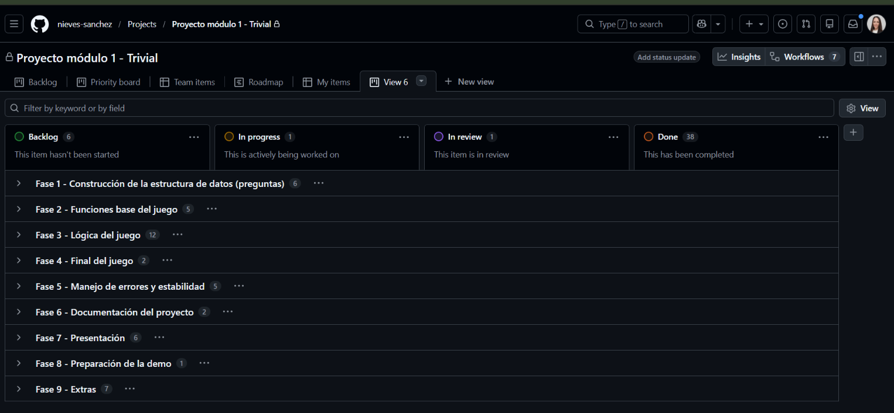

# Trivial de películas y series en Python

    

Proyecto académico del módulo 1 del **Bootcamp de Data Analytics & IA de Adalab**, en equipo de tres personas y con Scrum.



---

## Resumen del proyecto

- **Qué es:** un juego de preguntas y respuestas en consola sobre películas y series, con una versión gráfica en Pygame.
- **Reglas:** el jugador elige cuántas preguntas quiere (mínimo 5), tiene 3 vidas y pierde una por cada fallo; cada acierto suma un punto.
- **Qué practica:** listas y diccionarios, funciones, bucles, condicionales, control de errores con `try/except` y `random.sample`.
- **Cómo lo organizamos:** 9 fases (milestones) y 46 tareas en un tablero Kanban de GitHub Projects.

---

**📌 Mi contribución en este proyecto**  
He sido la Scrum Master: he organizado el trabajo en 9 fases y 46 tareas en el tablero Kanban, he hecho el seguimiento de los avances, he preparado la versión con Pygame y he trabajado en el README. Camila López ha programado la lógica del juego (funciones, vidas y control de errores) y María Granero se ha encargado de la estructura de datos de las preguntas, el README, la presentación y las pruebas del juego.

---

## Autoras

**Camila López**

[](https://github.com/camilalopezmrt)

**María Granero**

[](https://github.com/mariagranero)

**Nieves Sánchez**

[](https://github.com/nieves-sanchez)
[](https://www.linkedin.com/in/nieves-sanchez-data)
[](mailto:nsanchezgarcia86@gmail.com)

---

## Organización del trabajo

| Fase | Contenido | Tareas |
|---|---|---|
| 1 | Construcción de la estructura de datos (preguntas) | 6 |
| 2 | Funciones base del juego | 5 |
| 3 | Lógica del juego | 12 |
| 4 | Final del juego | 2 |
| 5 | Manejo de errores y estabilidad | 5 |
| 6 | Documentación del proyecto | 2 |
| 7 | Presentación | 6 |
| 8 | Preparación de la demo | 1 |
| 9 | Extras | 7 |

Cada tarea pasaba por las columnas Backlog, In progress, In review y Done del tablero.

| Persona | Rol | Tareas principales |
|---|---|---|
| Nieves Sánchez | Scrum Master | Organización, tablero Kanban, milestones, seguimiento de avances, versión Pygame, README y revisión |
| Camila López | Desarrollo | Lógica del juego, funciones, control de errores y revisión |
| María Granero | Documentación | Estructura de datos, README, presentación, prueba del juego y revisión |

---

## Cómo funciona el juego

1. **Inicio:** pide el nombre y el número de preguntas, y comprueba que sea un número entre 5 y el total disponible.
2. **Preparación:** elige las preguntas al azar con `random.sample()` y empieza con 0 puntos y 3 vidas.
3. **Partida:** muestra cada pregunta con sus opciones A–D, valida la respuesta y suma un punto o resta una vida.
4. **Final:** termina al responder todas las preguntas o al quedarse sin vidas, y muestra la puntuación.

Las preguntas son una lista de diccionarios:

```python
preguntas = [
    {
        "pregunta": "Un pueblo donde lo inexplicable...",
        "opciones": {"A": "Dark", "B": "Stranger Things", "C": "The OA", "D": "Glitch"},
        "respuesta_correcta": "B"
    },
    ...
]
```

---

## Pruebas realizadas

| Prueba | Resultado |
|---|---|
| Introducir texto en lugar de número | Error controlado con `try/except` |
| Elegir menos de 5 preguntas | Mensaje y nueva petición |
| Elegir más preguntas de las disponibles | Mensaje y nueva petición |
| Responder en minúsculas | Se convierte a mayúsculas con `.upper()` |
| Perder todas las vidas | La partida termina con `break` |

---

## Estructura del repositorio

```text
.
├── README.md
├── trivial.ipynb                                   # versión en consola
├── trivial_pygame/                                 # versión gráfica
│   ├── main.py
│   ├── ui_utils.py
│   └── preguntas.py
├── Trivial Películas y Series que Dejan Huella.pdf  # presentación
└── assets/                                         # captura del tablero
```

---

## Cómo ejecutarlo

**En Jupyter:** abre `trivial.ipynb` y ejecuta todas las celdas.

**Con Pygame:**

```bash
git clone https://github.com/nieves-sanchez/proyecto-da-promo-64-modulo-1-team-2.git
cd proyecto-da-promo-64-modulo-1-team-2
pip install pygame
python trivial_pygame/main.py
```

---

Proyecto con fines educativos, parte del Bootcamp de Data Analytics & IA de Adalab.
